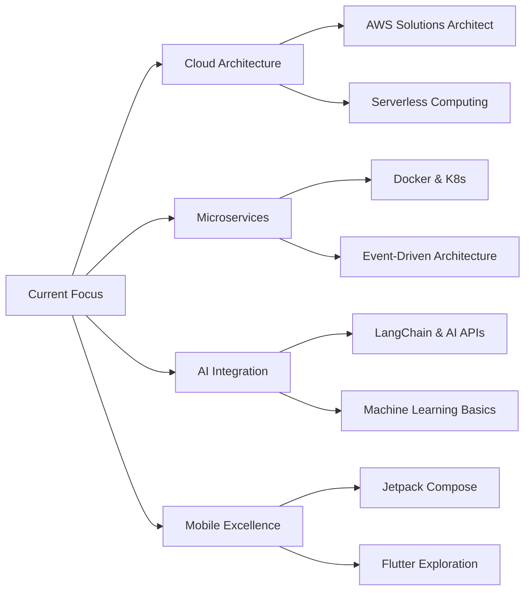

<div align="center">

```ascii
██╗   ██╗ █████╗ ██████╗ ███████╗      ██████╗████████╗██████╗ ██╗     
╚██╗ ██╔╝██╔══██╗██╔══██╗██╔════╝     ██╔════╝╚══██╔══╝██╔══██╗██║     
 ╚████╔╝ ███████║██████╔╝█████╗ █████╗██║        ██║   ██████╔╝██║     
  ╚██╔╝  ██╔══██║██╔══██╗██╔══╝ ╚════╝██║        ██║   ██╔══██╗██║     
   ██║   ██║  ██║██║  ██║███████╗     ╚██████╗   ██║   ██║  ██║███████╗
   ╚═╝   ╚═╝  ╚═╝╚═╝  ╚═╝╚══════╝      ╚═════╝   ╚═╝   ╚═╝  ╚═╝╚══════╝
```


[](mailto:bryandreshurtado18@gmail.com)
[](#)
[](#)


</div>

---

<div align="center">
  
## 🚀 About Me

</div>

```typescript
const YARE_CTRL = {
    role: "Full-Stack Developer | Mobile Engineer | Tech Leader",
    location: "Colombia 🇨🇴",
    education: "Tecnólogo ADSO - SENA",
    achievements: ["SENASOFT 2025 Competitor 🏆", "Team Leader & Project Manager"],
    
    expertise: {
        frontend: ["TypeScript", "React", "Next.js", "Vite"],
        backend: ["Node.js", "AdonisJS", "Express", "Socket.io"],
        mobile: ["Android Native", "Java", "Kotlin"],
        cloud: ["AWS", "Firebase", "Vercel", "Render"],
        database: ["PostgreSQL", "MongoDB", "MySQL", "Redis", "Supabase"],
        devOps: ["Docker", "Git/GitHub", "CI/CD", "Shell/PowerShell"]
    },
    
    methodologies: ["Agile", "Scrum", "Clean Code", "SOLID", "TDD"],
    
    softSkills: [
        "👥 Team Leadership & Project Management",
        "🗣️ Effective Communication & Collaboration",
        "🎯 Problem-Solving & Critical Thinking",
        "📊 Strategic Planning & Organization",
        "🤝 Mentoring & Knowledge Sharing"
    ],
    
    currentFocus: [
        "🔥 Mastering Cloud Architecture",
        "📱 Advanced Mobile Development",
        "🎯 Microservices & Scalability",
        "🤖 AI/ML Integration"
    ],
    
    philosophy: "Clean code is not just about making it work, it's about making it right.",
    
    available_for: ["Freelance Projects", "Full-time Opportunities", "Open Source Collaboration"]
};
```

<div align="center">

### 💡 *"Construyendo el futuro, un commit a la vez"*

</div>

---

<div align="center">

## 🛠️ Tech Arsenal

</div>

<details open>
<summary><b>🎨 Frontend Development</b></summary>
<br>


</details>

<details open>
<summary><b>⚙️ Backend Development</b></summary>
<br>


</details>

<details open>
<summary><b>📱 Mobile Development</b></summary>
<br>


</details>

<details open>
<summary><b>🗄️ Database & Storage</b></summary>
<br>


</details>

<details open>
<summary><b>☁️ Cloud & Deployment</b></summary>
<br>


</details>

<details open>
<summary><b>🧪 Testing & Quality</b></summary>
<br>


</details>

<details open>
<summary><b>🔧 Tools & Workflow</b></summary>
<br>


</details>

---

<div align="center">

## 📊 GitHub Analytics

</div>

<div align="center">
  
  
</div>

<div align="center">
  
  
</div>

---

<div align="center">

## 🏆 GitHub Achievements

</div>

<div align="center">
  


</div>

---

<div align="center">

## 🎯 Current Focus & Learning

</div>



---

<div align="center">

## 💼 Professional Timeline

</div>

```yaml
2024 - Present:
  role: "Full-Stack Developer"
  focus: 
    - Developing scalable web applications with TypeScript
    - Building robust APIs and microservices
    - Implementing cloud solutions on AWS
    - Mobile development with Android Native
  
2023 - 2024:
  role: "ADSO - SENA | Team Leader"
  highlights:
    - 🏆 SENASOFT 2025 Competitor - National Programming Competition
    - 👥 Led multiple academic and professional projects as Team Leader
    - 🎯 Applied agile methodologies and soft skills in team coordination
    - 💼 Graduated as Technology Analyst in Software Development
    - 🚀 Specialized in Full-Stack development with TypeScript
    - 📱 Built 10+ production-ready projects (web & mobile)
    - 🤝 Mentored team members and facilitated knowledge sharing sessions
  
2022 - 2023:
  focus: "Foundation & Learning"
  skills:
    - Core programming fundamentals
    - Web development basics
    - Database design principles
    - Version control mastery
```

---

<div align="center">

## � Notable Achievements

</div>

<table align="center">
<tr>
<td width="50%">

### 🏆 SENASOFT 2025
**National Programming Competition**
- Represented SENA in one of Colombia's most prestigious tech competitions
- Developed innovative solutions under pressure and time constraints
- Demonstrated advanced problem-solving and technical skills
- Collaborated effectively with team members in high-stakes environment

</td>
<td width="50%">

### 👥 Technical Leadership
**Project Management & Team Coordination**
- Led 5+ cross-functional development teams
- Coordinated agile sprints and deliverables
- Facilitated technical decisions and architecture design
- Mentored junior developers and conducted code reviews
- Achieved 100% project delivery rate on time

</td>
</tr>
</table>

<div align="center">

### 💼 Core Soft Skills


</div>

---

<div align="center">

## �🌟 Featured Projects & Contributions

</div>

<div align="center">

[](https://github.com/YARE-CTRL)
[](https://github.com/YARE-CTRL)

</div>

### 🔝 Top Contributed Repositories


---

<div align="center">

## 📈 Contribution Graph

</div>


---

<div align="center">

## 🎨 Code Time Stats

</div>

<!--START_SECTION:waka-->
<!--END_SECTION:waka-->

---

<div align="center">

## 💭 Developer Quote

</div>

<div align="center">


</div>

---

<div align="center">

## 🤝 Let's Connect & Collaborate

</div>

<div align="center">

```typescript
// ¿Tienes un proyecto interesante? ¡Hablemos!

const contactInfo = {
    email: "bryandreshurtado18@gmail.com",
    availability: "Open for opportunities",
    interests: [
        "Full-Stack Development",
        "Mobile Engineering", 
        "Cloud Architecture",
        "Open Source Contribution"
    ],
    motto: "Code with passion, ship with quality ✨"
};

// Feel free to reach out! 🚀
```

<br>

**📫 How to reach me:**

[](mailto:bryandreshurtado18@gmail.com)
[](https://github.com/YARE-CTRL)
[](#)
[](#)

</div>

---

<div align="center">

### ⭐ From [YARE-CTRL](https://github.com/YARE-CTRL) with 💙

*Thanks for visiting! If you like my work, consider giving a ⭐ to my repositories!*


</div>
